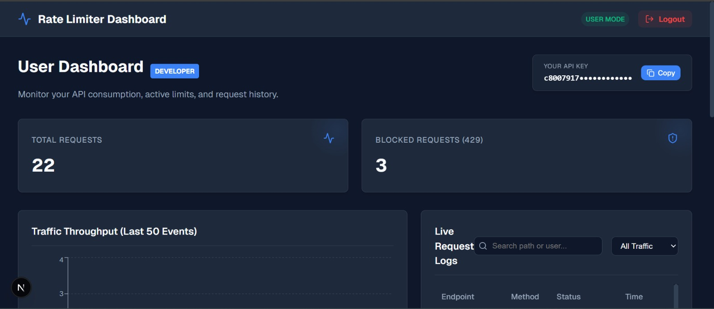
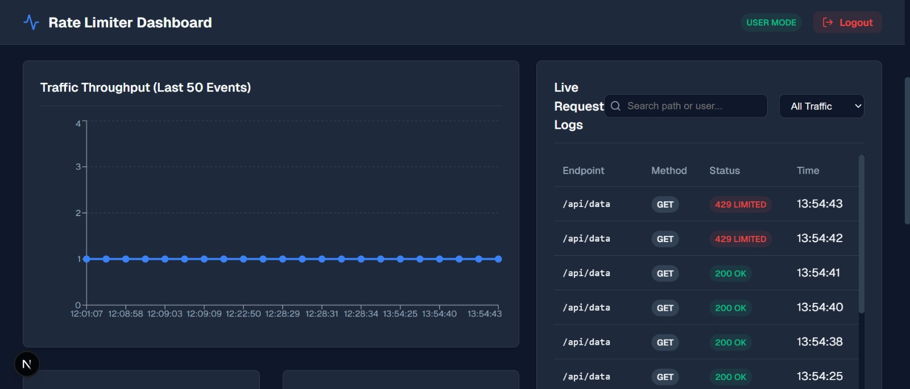
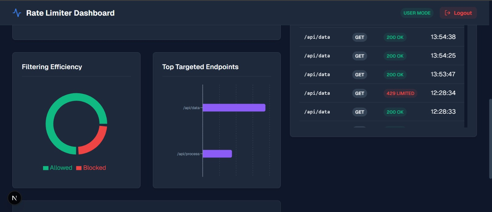
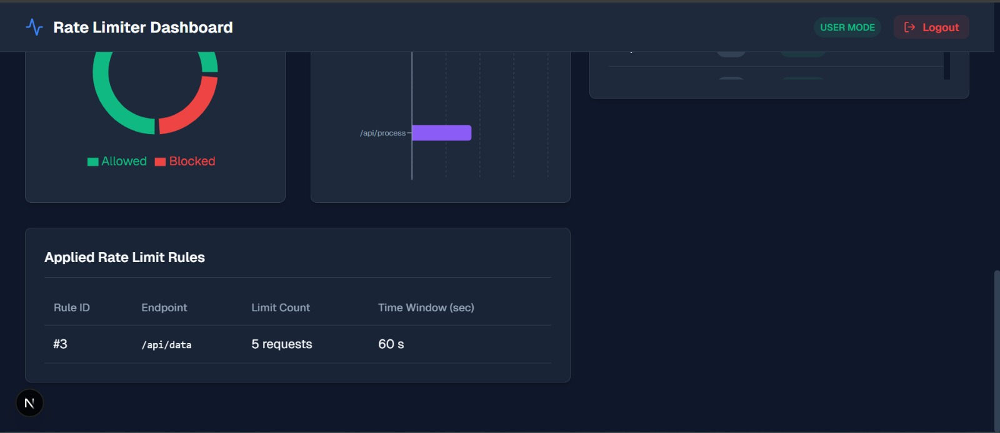

# 🛡️ API Rate Limiter & Monitoring System

A professional, real-time API Rate Limiting dashboard and backend system. This project provides a robust solution for managing API traffic, preventing abuse, and monitoring system health via a sleek, interactive dashboard.

---

## Links

1. Youtube Demo Video:
```text
https://www.youtube.com/watch?v=ScePRdUNRNw
```

2. API Documentation (Postman):
```text
https://documenter.getpostman.com/view/39216679/2sBXqCNiTR
```

## 🚀 Key Features

*   **🔐 Multi-Layer Authentication:** Secure authentication and validation with unique **API Key generation** for every user.
*   **⚖️ Dynamic Rate Limiting:** Manage rules in real-time without restarting the server.
    *   **GLOBAL:** Apply limits to all users for specific endpoints.
    *   **USER:** Set custom quotas for individual users.
    *   **API_KEY:** Precision control for specific developer keys.
*   **📊 Live Monitoring Dashboard:**
    *   **Traffic Throughput:** Real-time charts showing request volume.
    *   **Live Audit Logs:** Instant visibility into every allowed (200) and blocked (429) request.
    *   **Stat Cards:** High-level metrics for Total Requests, Blocked Events, and Active Rules.
*   **🧪 Integrated API Tester:** Built-in terminal to test your APIs and rate limits directly from the browser.
*   **👥 RBAC (Role-Based Access Control):** Admin-only control panel for managing global rules and system-wide logs.

---

## 📸 Screenshots 

### 📊 Dashboard Overview


### 📜 Live Request Logs (200 vs 429)


### 📈 Traffic & Rate Limiting Analytics


### ⚙️ Applied Rate Limit Rules


---

## 🛠️ Tech Stack

### Backend
- **Java 17** with **Spring Boot 3**
- **Spring Security** (Custom Filter & Interceptors)
- **Spring Data JPA** (MySQL Persistence)
- **Lombok** (Boilerplate reduction)

### Frontend
- **Next.js 14** (App Router)
- **TypeScript**
- **Recharts** (Visual Analytics)
- **Lucide Icons**
- **Vanilla CSS** (Custom Premium Glassmorphism UI)

---

## ⚙️ How It Works (The Core Logic)

1.  **Interceptor Layer:** Every request is checked for a valid `API-KEY` header.
2.  **Filter Layer:** The `RateLimiterFilter` intercepts requests to protected paths (e.g., `/api/**`).
3.  **Hierarchy Check:** The system looks for rules in the order: **API_KEY > USER > GLOBAL**.
4.  **Sliding Window:** It queries the request history within the defined `timeWindow` (e.g., 60 seconds).
5.  **Decision:** 
    - If `count < limit`, the request proceeds and is logged as `200`.
    - If `count >= limit`, the request is rejected with **`429 Too Many Requests`**.

---

## 🛠️ Setup & Installation

### 1. Prerequisites
- JDK 17+
- Node.js 18+
- MySQL Server

### 2. Backend Setup
```bash
cd backend
# Update application.properties with your MySQL credentials
./mvnw spring-boot:run
```

### 3. Frontend Setup
```bash
cd frontend
npm install
npm run dev
```
